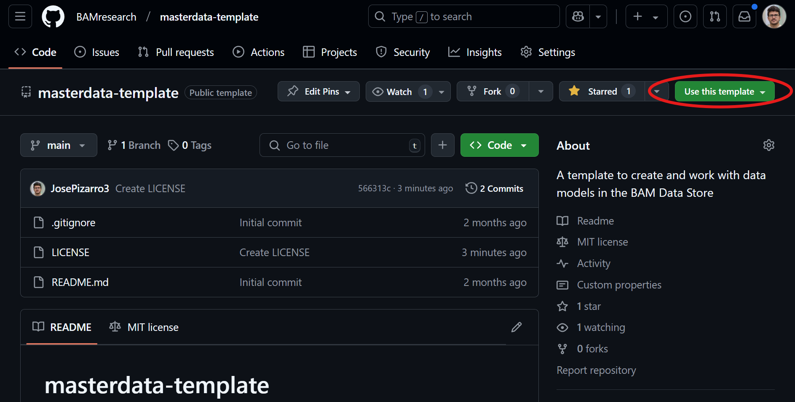

# masterdata-template
A template to create and work with Masterdata definitions in the BAM Data Store.

## Generating your Masterdata repository

1. Click on **Use this template** button on the top right and create a new Masterdata repository. 



2. The next screen will prompt you to chose a Github organization or profile for the new repository, as well as a name. We recommend you naming the repository starting with `masterdata-`, so it is easy to be recognized.
3. After creating your new repository, you can:
    1. Open in Github Codespace
    2. Clone it locally
4. You need to [install `cruft`](https://cruft.github.io/cruft/#installation).
5. Run the following command to create the structure of the new Masterdata project:
```sh
cruft create https://github.com/BAMresearch/masterdata-generator
```

This will prompt you with some questions to be filled in:
```sh
  [1/9] author (Erika Mustermann): 
  [2/9] email (erika.mustermann@bam.de): 
  [3/9] Github organization or profile name (BAMResearch): 
  [4/9] project_name (masterdata-example): 
  [5/9] The name of the folder src/<module_name>, default is the 
<project_name> separated with underscores (masterdata_example): 
  [6/9] short_description (A short description for the masterdata project.): 
  [7/9] include_python_masterdata [y/n] (y): 
  [8/9] include_excel_masterdata [y/n] (y): 
  [9/9] include_rdfxml_masterdata [y/n] (y): 
```

> [!NOTE]
> Not filling anything on the questions above will result on chosing the default. The default value for each question is defined in between parenthesis next to the question.

6. The files generated by `cruft` are created under `./<project-name>`. To move all the structure one level up, run:
```sh
sh <project-name>/move_generated_files.sh
```

7. After filling the questionnaire and running the `move_generated_files.sh` script, you will have a new repository with:
```sh
masterdata-<name>/
├── LICENSE (MIT)
├── README.md
├── pyproject.toml
├── src/
│   └── masterdata-<name>/
#        if Python is selected as an option
│       ├── __init__.py
│       ├── object_types.py
│       ├── vocabulary_types.py
#       if Excel is selected as an option
│       ├── masterdata.xlsx
#       if RDF/XML is selected as an option
│       └── masterdata.owl
└── tests/
    ├── __init__.py
    └── test.py
```

8. If you are using Python, you can install the package and its dependencies by creating a virtual environment (either with `conda` or `venv`) and running:
```sh
python3 -m venv .venv
source .venv/bin/activate
pip install --upgrade pip
pip install uv
uv pip install -e '.[dev]'
```

> [!NOTE]
> Step 8 is defined using `venv` for creating a virtual environment in an Ubuntu OS. Please, modify the commands if you use `conda` or you are installing in Windows/MacOS.

## Development

Once you have the skeleton of the Masterdata repository, you can define new classes in the corresponding file under `src/<module-name>/`.

In case of Python, these are different modules for Object Types and Vocabularies. For Excel or RDF/XML, this is a single file named `masterdata.xlsx`/`masterdata.owl`, respectively. In all the cases, a dummy entity called `ExampleObjectType` is created to serve as an example.

You can export from Python to the other formats using the `bam-masterdata` CLI. You can also generate Python code from Excel or RDF/XML with the same CLI. Read more in the [`bam-masterdata` documentation](https://bamresearch.github.io/bam-masterdata/).

## Github actions

A set of Github actions are defined in `.github/workflows/`. These will:
1. Ensure typing and formatting consistency in Python code following PEP-8 standards using `mypy` and `ruff` rules defined in the `pyproject.toml`.
2. Check consistency of the Masterdata definitions using the `bam-masterdata` checker CLI functionalities.

If the pipeline passes, it means your Masterdata definitions are formatted properly and do not clash with the current `bam-masterdata` definitions.

> [!IMPORTANT]
> In `bam-masterdata`, there is a set of Masterdata entities already defined. These correspond to the **general definitions** (to be used across MSE sub-communities). If you want to know how to define new Masterdata entities using inheritance from the general ones, read the [corresponding documentation](https://bamresearch.github.io/bam-masterdata/).

## Publishing Masterdata as an independent PyPI package

The action `.github/workflows/publish.yml` already implements the publishing of your repository to PyPI. When you are ready, you need:
1. Define a secret and name it `PYPI_API_TOKEN` from [pypi.org](https://pypi.org/).
2. Create a **Release** from the Github page of your repository.

Read more here: [Github PyPI documentation](https://packaging.python.org/en/latest/guides/publishing-package-distribution-releases-using-github-actions-ci-cd-workflows/).
